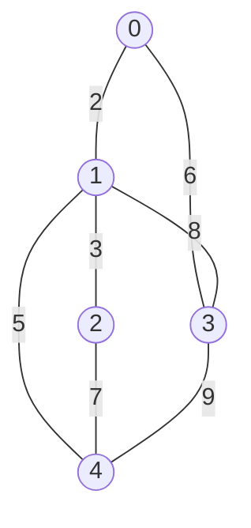
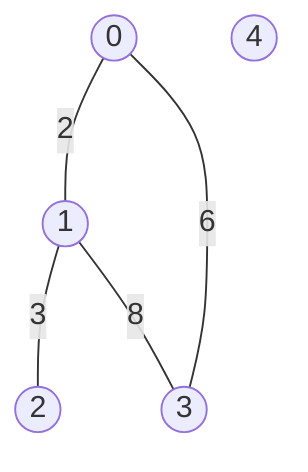
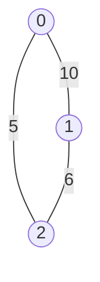

# Floyd-Warshall algorithm
 
## Purpose 
 
The coding exercise is designed to test knowledge of the following concepts: 
 
* Floyd-Warshall algorithm 
 
## Overview 
 
The coding exercise covers the following practical problems: 
* Finding all-pairs shortest path 
 
## Coding exercises 
 
### Exercise 1: Finding all-pairs shortest path 
 
Given the number of vertices `n`, graph adjacency matrix `adj_matrix` of an undirected weighted graph, implement the function below that returns two arguments. The first argument is the sum of all-pairs shortest paths between all achievable vertices. And the second is the number of the unachievable pairs of vertices in an undirected weighted graph.  
Vertices are enumerated from `0` to `n-1`. `adj_matrix` contains only non-negative values, 0 means no edge and a positive value means edge presence and reflects its weight. 
Each weight of (`u`, `v`)-edge represents a distance between `u` and `v` and vice versa.  
 
Expected algorithm complexity is O(N^3), N(`n`) - number of vertices.
 
```python 
def get_sum_of_all_pairs_shortest_paths(n: int, adj_matrix: List[List[int]]) -> Tuple[int, int]:
    """
    Returns the tuple, where the first value is the sum of all-pairs shortest paths between all achievable vertices
    and the second is the number of the unachievable pairs of vertices in an undirected weighted graph.
    The weight of (u,v)-edge represents a distance between 'u' and 'v' and vice versa.

    Edges are stored as an adjacency matrix, where 0 means no edge and a positive value means edge presence and
    reflects its weight.
    Expected algorithm complexity is O(N^3), where N - number of vertices.
    Vertices are enumerated from 0 to N-1, there N - number of vertices.

    E.g. there is a graph with 3 vertices from 0 to 2 and adjacency matrix:
    [[0, 10, 5], [10, 0, 6], [5, 6, 0]]
    The expected result is (42, 0).

    Parameters:
        n (int) : number of vertices in the graph, vertices are enumerated from 0 to n-1
        adj_matrix (List[List[int]]): adjacency matrix with weights
    Returns:
        Tuple [int, int]: the sum of all-pairs shortest paths between all achievable vertices
        and the number of the unachievable pairs of vertices
    """
    pass
``` 
 
**Example 1:** 

`n` = `5` 
<br>
`edges` = `[[0, 2, 0, 6, 0], 
            [2, 0, 3, 8, 5], 
            [0, 3, 0, 0, 7], 
            [6, 8, 0, 0, 9],
            [0, 5, 7, 9, 0]]` 
 
Expected result: `(80, 0)` 
 
**Example 2:** 

`n` = `5` 
<br>
`edges` = `[[0, 2, 0, 6, 0],
            [2, 0, 3, 8, 0],
            [0, 3, 0, 0, 0],
            [6, 8, 0, 0, 0],
            [0, 0, 0, 0, 0]]` 
 
Expected result: `(38, 12)` 
 
**Example 3:** 

`n` = `3` 
<br>
`edges` = `[[0, 10, 5],
            [10, 0, 6],
            [5, 6, 0]]` 
 
Expected result: `(42, 0)` 

Please use a template for the implementation (`tasks/all_pairs_shortest_paths:get_sum_of_all_pairs_shortest_paths`). 
 